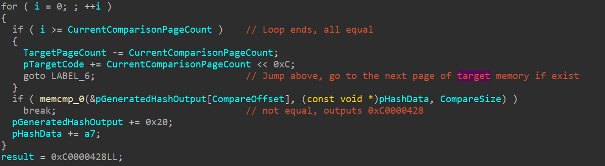

# Introduction

Microsoft Warbird, also known as Warbird, is an obfuscation framework or packer developed by Microsoft to protect sensitive Windows internals, including licensing, DRM, and core security features such as Code Integrity (CI). This code protection system is built into Windows to make reversing key components like ci.dll, clipsp.sys, and peauth.sys much harder. It dynamically encrypts and decrypts kernel-mode code at runtime, making static analysis of some part of the software impossible. What’s even more interesting is that **Warbird works even on systems with Hypervisor-Enforced Code Integrity (HVCI) and Virtualization-Based Security (VBS), where dynamic code (kernel memory that can change between writable to executable and vice versa) execution in the kernel is supposed to be impossible**. This research examines how Warbird encrypts and decrypts kernel code and how it "bypasses" HVCI and VBS. At the end of this research, I hope at least one of these 2 things :

1. Find out how MS breaks their own rules by allowing dynamic codes (warbird) in an HVCI-protected kernel
2. Find out how to execute my own dynamic code on the VTL0 kernel with HVCI enabled

In this research, all of the binaries that will be analyzed are from Windows 11 version 24H2 (build 26100.6584).

1. clipsp.sys (v10.0.26100.5074) SHA1 : e5483ceec03e5baa203c12e0d3749e8f66bb5fba
2. ntoskrnl.exe (v10.0.26100.6584) SHA1 : 16f05adb58478bcfc5e8773dc6ba30a040c2340d
3. securekernel.exe (v10.0.26100.5074) SHA1 : 0b6d2ea1c1d996370fc6924ae5cf939a220ad160
4. skci.dll (v10.0.26100.5074) SHA1 : 6d4ae8bf308a702bdb9723c22c38040bba7088b9

Disclaimer : This is my first ever deep reverse engineering, so don't expect the best quality. Expect revisions in the future.

## clipsp.sys

Our analysis starts at `clipsp.sys`, a kernel driver that is part of the Windows client licensing service. This driver is protected by Warbird. First, before we begin to reverse engineer the inner working of Warbird inside `clipsp.sys`, let's take a look at the "outer" of the PE itself using [PE-bear](https://github.com/hasherezade/pe-bear). If we check on the sections of the PE binary, we can already see some clues/signatures about the presence of Warbird. There are some peculiar sections that are not common on normal PEs, and look at the name of them, `PAGEwx`? `wx` means writable executable? Very interesting indeed.

Next, let's start to reverse engineer the Warbird routines inside `clipsp.sys`. Because we don't have any symbol on this driver, let's start our analysis on the exported routine `ClipSpInitialize`.

Here, we can see that it first checks if the `WarbirdMutex` is initialized; if it's not, then it initializes it using `KeInitializeEvent`. After that, it tries to decrypt the PAGEwx1 and PAGEwx3 warbird-packed section, before it executes a code that resides in the PAGEwx1 section. And after it executes the function inside PAGEwx1, it re-encrypts the PAGEwx1 and PAGEwx3 sections. We will focus on the `WarbirdDecryptSection` and `WarbirdReencryptSection` functions.

As you might notice, these 2 functions are actually is just a wrapper function for the same function, `WarbirdEncryptDecryptSection`. These 2 functions lock the `WarbirdMutex` mutex and check for the decryption count stored at the `DecryptionData2` structure. If the decryption count is one, then the `WarbirdEncryptDecryptSection` re-encrypts it, and if the decryption count is 0, then the `WarbirdEncryptDecryptSection` decrypts it. This is a way to make the warbird encryption and decryption work in a multithreaded case (where multiple threads are using the instructions inside the warbird-packed sections and are trying to decrypt/reencrypt the section at the same time). Next, let's take a look at how `WarbirdEncryptDecryptSection` works.

It first initializes a structure that I call `PAGEWX_PREPARATION_INFO`, which contains information like the PAGEwx number and index, MDLs created while encrypting/decrypting the section, current operation (is it encrypt/decrypt), important pointers, etc. After that, `WarbirdEncryptDecryptSection` will call `WarbirdPrepareSectionForModification`; this function will create the main MDL for the encrypted PAGEwx section, and then use `MmChangeImageProtection` to change the encrypted PAGEwx section to writable (RW). The MmChangeImageProtection is supplied with 4 parameters: the first parameter is the PAGEwx main MDL, the second parameter is a hash (or at least partial, more on this later), the third parameter is the total size of the hash supplied, and the fourth is the protection flag. MmChangeImageProtection is an undocumented function that, I think, only `clipsp.sys` imports, so we can deduce that MS created this function JUST for kernel-mode warbird. We will talk about `MmChangeImageProtection` further later in this analysis.

After successfully preparing the PAGEwx section for modification, the `WarbirdEncryptDecryptSection` continues with an encryption/decryption loop with a Feistel cipher that they implement. Each loop started with the creation of a writable MDL mapping with a specific starting VA from the Decryption Data 1 of the PAGEwx section, and after that, the execution is passed to either `WarbirdFeistelEncrypt` or `WarbirdFeistelDecrypt`. I won't be talking about the specifics of their Feistel cipher encryption or decryption implementation.

And at last, we have arrived at the end of the Warbird encryption/decryption routine. It first cleans any remaining writable MDL mapping that's used for the Feistel encryption/decryption operation, and then it calls `WarbirdFinishSectionModification`. This is the function that will do the job of changing the section from writable to executable in a decryption routine.

So, here we can see what `WarbirdFinishSectionModification` does. If it's an encryption routine, it will try to lock the section and unlock it immediately. To be honest, I have no idea why they do this, and it is even more bizarre when they lock it once and then unlock it twice. Anyway, let's focus our attention on when it's a decryption routine. Here, we can see that it calls `MmChangeImageProtection` again, but the difference between this call and the previous call on `WarbirdPrepareSectionForModification` is that the fourth parameter is set to 1 instead of 2. I think this indicates that it wants to change the protection to executable. And after the `MmChangeImageProtection` call, it cleans up the PAGEwx main MDL and cleans up the `PAGEWX_PREPARATION_INFO` data.

On the next part of the analysis, we will deep dive into `MmChangeImageProtection`, how it works, and how it interoperates with the VTL1.

## ntoskrnl.exe - MmChangeImageProtection

As I mentioned before, `MmChangeImageProtection` is an undocumented function that's used only by the Warbird internal routine. It is the most crucial function in the Warbird routine, whose job is to modify memory protections, essentially allowing dynamic code in the kernel. Without `MmChangeImageProtection`, the whole idea of kernel-mode warbird-packed binaries wouldn't be possible. As we know from before, `MmChangeImageProtection` is used twice, in the `WarbirdPrepareSectionForModification`, where it changes the memory protection to writable, allowing the PAGEwx section to be modified, and in `WarbirdFinishSectionModification`, where it is used to change the memory protection to executable, allowing the decrypted instructions in the PAGEwx section to be called and executed.

`MmChangeImageProtection` takes 4 parameters, the first parameter is the target MDL which is the PAGEwx main MDL, the second parameter is the pointer to the decrypted PAGEwx partial (again, more on this later) SHA512 hash/signature (which is located at the `PAGEHrx` section of `clipsp.sys`), the third parameter is the total length of the hash that will be supplied to `MmChangeImageProtection`, and the fourth parameter is the protection flag, which will determine whether the protection that it will change to, either writable to executable.

At the beginning, `MmChangeImageProtection` checks for the parameters, makes sure that the MDL it receives is valid, and it also checks if the hash supplied sits inside the module of the memory that the MmChangeImageProtection is trying to change the protection. This means the hash that is supplied to it must be from the target module (in this case, `clipsp.sys`) itself. Next, this function will check if this module is paged in and in-memory, and it will do some more checks on the underlying PFNs from the PAGEwx main MDL. After all of those, here comes the important part, first it change the memory protection of the target memory to writable, checks if the protection flag parameter is set to executable, and if it is then it checks if either HVCI (indicated by the `StrongCodeGuarantees` bit in `MiFlag`) is turned off or the `VslValidateDynamicCodePages` returns `NT_SUCCESS` status. Now there will be 2 things that will happen that depend on the return code of `VslValidateDynamicCodePages`, if it just returns `NT_SUCCESS` codes **and not 0x12c**, that means the **validity check on the dynamic code failed** and the memory protection will be changed **ONLY ON THE VTL0 LEVEL!** Meaning is that the VTL0 PTE is marked as executable, but when you execute it, you will still get an access violation, because the VTL1 EPTE is still set to writable. But if `VslValidateDynamicCodePages` **returns 0x12c**, that means the **validity check succeeds**, the dynamic code is deemed valid, and **both the VTL0 PTE and the VTL1 EPTE are set to executable**.

Now you might be asking, `What does this have to do with the "partial" hashes you mentioned before?` Well, it has to do with everything. `VslValidateDynamicCodePages` is the function that `MmChangeImageProtection` uses to essentially communicate and interoperates with the VTL1 kernel, A.K.A. the Secure Kernel. And through this, the "partial" hashes are used to validate the dynamic code and determine if the VTL1 EPTE is going to be set to executable or not. In the next part of the analysis, we will deep dive into `VslValidateDynamicCodePages`, what data or parameters it takes, and how it transfers them to VTL1.

## ntoskrnl.exe - VslValidateDynamicCodePages

`VslValidateDynamicCodePages` is another undocumented function that's used by `MmChangeImageProtection` to validate the dynamic code and interoperates with the VTL1 kernel. This function's job is to prepare our data for transfer to the VTL1 kernel and to emit the `vmcall` (A.K.A. hypercall) instruction using the corresponding secure system call number, in this case `0x20`, to actually call the actual secure kernel function, which is `SkmiValidateDynamicCodePages`. This function takes 3 parameters. The first parameter is the target MDL, which in this context is our PAGEwx main MDL. The second parameter is a pointer to our partial hashes, and the third parameter is the total hash size supplied. The first thing this function does is to create another MDL for our target MDL. From what I observed, any data transfer to VTL1 always requires this "second level" MDL, where it creates another MDL that maps the first MDL, pretty cool huh? After it creates another MDL that maps our target MDL, it also creates an MDL and another MDL for the first MDL for our hash buffer using the `VslpLockPagesForTransfer` function. After that, it will send a pointer to the original (or the first level) target MDL, the PFN of the original target MDL that's created from the second level target MDL, a pointer to the first level hash MDL, the PFN of the first level MDL that's created from the second level hash MDL, and the SSCN (secure service call number) that we want to call, then it gets packaged all up into a single data structure called `SKCALL`. And after that, it will call `VslpEnterIumSecureMode`, which is the function that will emit the `vmcall` instruction and call our target function that the SSCN points to.

In the next part of our analysis, we will deep dive into `SkmiValidateDynamicCodePages`, which is the secure kernel function in VTL1 that our previous SSCN will point to.

## securekernel.exe - SkmiValidateDynamicCodePages

Before we arrive at `SkmiValidateDynamicCodePages`, all secure kernel calls will arrive at `IumInvokeSecureService`. In this function, there will be a huge switch case that will handle each SSCN. If we take a look at the `0x20` switch case, we will see this piece of code below. Here, we can see that it collects the parameters from the `SKCALL` structure, and then it creates its own MDL mapping of the hash data based on the given hash MDL and the PFN. After that, it copies all of the previous parameters, packages it into its own structure, and passes it to `SkmiValidateDynamicCodePages` through `SkmiOperateOnLockedNar`. I won't go deep into how `SkmiOperateOnLockedNar` works because of how lacking the current information we have about NAR structure.

From the `SkmiOperateOnLockedNar`, the execution is then passed to `SkmiValidateDynamicCodePages` by passing 2 things, a pointer to a NAR tree entry and a structure containing previous parameters like the copied hash MDL thats used to create its own MDL mapping of the hash data, the starting VA of the hash data, the target MDL, and the target MDL PFN. In the `SkmiValidateDynamicCodePages`, it starts with creating its own MDL mapping of the target memory based on the given target MDL and its PFN, because if you remember from before, only the hash data is mapped until now. And then, it locks the driver pages and claim the physical pages of the target memory.

After that, the code inspects the PTEs for the hash pages, verifies present/non‑large PDE, that PTEs are MDL/transfer‑mapped, and compares the PTE PFNs against the PFN list produced when the hash MDL was prepared. It also calls `SkmiLockImagePage` / `SkmiIncrementImagePageReferenceCount` against per‑image structures in the NAR entry. Any PFN mismatch, wrong PTE flags, or lack of image‑page ownership triggers `SKMI_SECURITY` and failure. Also, there's another check regarding the hash data that happens before the VTL1 mapping of the target memory; it makes sure that the hash VA is located on a specific offset/region of a memory that is described by the NAR tree entry, which is where the `PAGEHrx` lives.

Next, it will call the function that will validate our dynamic code hash, which is `SkciValidateDynamicCodePages`, which will be discussed deeper in the next part of the analysis, and if it returns `NT_SUCCESS` codes, it will call `SkmiProtectSinglePage`, which will then **modify the EPTE of the target memory so that it will make it executable**. This is the important part, `SkciValidateDynamicCodePages` needs to return an `NT_SUCCESS` code so that our target memory, which in this context is those PAGEwx sections, will be marked as executable in the EPTE. Inside `SkmiProtectSinglePage`, it uses either a function called `ShvlpInitiateVariableHypercall` or `ShvlpInitiateFastHypercall`, both of which will emit a `vmcall` that will modify the VTL protection mask. You can check [here](https://learn.microsoft.com/en-us/virtualization/hyper-v-on-windows/tlfs/hypercalls/overview) to see the operations that `vmcall` can do.

After that, the function will do some cleanups like decrementing the page reference count, releasing physical pages, releasing other locks, and unmap the mapped target memory that came from VTL0. And when the function returns to `IumInvokeSecureService`, it will then unmap the mapped hash data that came from VTL0, too. In the next part of our analysis, we will discuss deeper about `SkciValidateDynamicCodePages`, what parameters it takes, how it generates the hash, and explain the "partial" hash from `clipsp.sys`.

## skci.dll - SkciValidateDynamicCodePages

`SkciValidateDynamicCodePages` is the function that will validate our dynamic code by generating a hash over the dynamic code and **comparing it with the one that it supplied with**. It takes 4 parameters, the first one is the target memory (which in this context is our dynamic code or the PAGEwx section), the second one is the target memory length, the third one is the hash, and the last one is the hash length. This function essentially is just a wrapper code for `CiValidateFullImagePages`, which is the one that actually generates the hash and compares it, and it will take `CiValidateFullImagePages`s return value and outputs `0x12c` if it returns an `NT_SUCCESS` code. We will analyze `CiValidateFullImagePages` in this part of the analysis.

`CiValidateFullImagePages` first calculates if the supplied hash is enough to validate all of the target memory. Next, it checks if the HashType is 0x800c, which corresponds to the SHA256 hash type. If it is, then it will acquire a parallel hashing context, which will be used to hash up to 8 pages at a time using `SymCryptParallelSha256Process`, but because the hash type supplied from `SkciValidateDynamicCodePages` is 0x800E, we can disregard this. Instead, it will generate a hash for a single page of the target memory using the `HashKComputeMemoryHash` function. Inside, it will call `HashpInitHash`, and from here, we know that 0x800E hash type corresponds to SHA512.

After it generates a hash for a single page of the target memory, it validates the generated hash with the supplied hash. Now here's what I meant by "partial" hashes. As you can see, it only compares the last 32 bytes of the generated SHA512 hash. This means that the hashes stored in `clipsp.sys` are "partial" hashes, because it only **stores the last 32 bytes of a SHA512 hash**.

From `SkciValidateDynamicCodePages`, if all dynamic code pages are validated, it will carry this `0x12c` return value back to `MmChangeImageProtection`.

# Recap

1. This analysis shows Warbird is a deliberate Windows kernel mechanism that enables controlled dynamic kernel code by packing sensitive routines into PAGEwx sections, decrypting them on demand, running them, then re-encrypting them.
2. Warbird uses MDLs and writable mappings plus a custom Feistel cipher to protect and modify section contents, and coordinates concurrent access with a mutex and decryption counters.
3. The critical enabler is `MmChangeImageProtection`: it mediates VTL0/VTL1 behavior by calling `VslValidateDynamicCodePages`, which packages MDLs and partial hashes into a vmcall (SSCN) to the Secure Kernel (`SkmiValidateDynamicCodePages`).
4. The Secure Kernel (Skmi) and skci.dll perform page-level validation (`CiValidateFullImagePages`). Warbird supplies a “partial” SHA‑512 (last 32 bytes) per page; a successful validation (translated to `0x12c`) causes the VTL1 EPTE to be made executable as well as the VTL0 PTE—otherwise only VTL0 is changed and execution still fails.
5. This design is an intentional interoperability between ntoskrnl, the Secure Kernel, and skci: it is not a simple bypass of HVCI/VBS but a controlled exception path where VTL1 ultimately authorizes dynamic executable pages after cryptographic validation.

# Vulnerability?

We can reimplement the warbird encryption and decryption routine, and inject our own instructions or shellcode into the decrypted PAGEwx section right before it calls the `WarbirdFinishSectionModification` function. And in the `WarbirdFinishSectionModification`, we can redirect the hash address to our own custom hash that's located on one of the `clipsp.sys`'s writable sections, or we can do a page remap attack on the existing hash that's located on the PAGEHrx section and modify it from there.

But no, here are a few reasons the above exploit wouldn't work:

- VA containment (NarBase + PageCount) ensures the hash VA sits in the NAR-managed range, which does not include other writable sections in `clipsp.sys`.
- Remapping the PAGEHrx VA does not change the NAR VA containment check, and Skmi’s PFN/PTE + image‑page validations are intended to catch remaps, so you can’t bypass the NAR checks by simply redirecting the PAGEHrx VA to another physical page from VTL0.

Feel free to discuss anything about Warbird with me. You can add my Discord, my username is `getrektboy`.

<!--
# Vulnerability?

1. We can try to supply a hash that is located in a different location within `clipsp.sys` than where it should be (for example, we can write the hash to the `.DATA` section because its writable), but keep the content the same as the original, and see if validation accepts it. We cant directly modify the hash right on where `clipsp.sys` stores it because the hash are stored in a section marked as executable, and ofcourse it would be protected by the EPTE, hence cant be changed to writable.
2. We can reimplement the warbird encryption and decryption routine, and inject our own instructions or shellcode into the decrypted PAGEwx section right before it calls the `WarbirdFinishSectionModification` function. And in the `WarbirdFinishSectionModification`, we can redirect the hash address to our own custom hash thats based on the injected PAGEwx section.

Update 1 : We **can not** use a hash that is located in a different location, it **must** come from the **original location** which is inside the `PAGEHrx` section. If we want to tamper with the hashes, we **need to** somehow **change the memory protection** of `PAGEHrx` section **to writable**. Counter-exploit : we might be able to use `MmChangeImageProtection` to change the `PAGEHrx` protection to writable since `MmChangeImageProtection` doesnt require hash if we want to change the protection to writable. Without the ability of tampering the hash, the number 2 vulnerability is unexploitable.
-->

# Resources

Here's a few resources that I can recommend if you're interested more about VBS, HVCI, and/or VTL1/Securekernel :

1. [Connor McGarr's HVCI blog post](https://connormcgarr.github.io/hvci)
2. [Connor McGarr's Secure Images](https://connormcgarr.github.io/secure-images/)
3. [Connor McGarr's KM Shadow Stacks](https://connormcgarr.github.io/km-shadow-stacks/)
4. [Intel VT-rp Part 1 by tandasat](https://tandasat.github.io/blog/2023/07/05/intel-vt-rp-part-1.html)
5. [Debugging the Windows Hypervisor: Inspecting SK Calls](https://dor00tkit.github.io/Dor00tkit/posts/debugging-the-windows-hypervisor-inspecting-sk-calls/)
6. [Rayanfam's Hypervisor From Scratch blog post](https://rayanfam.com/topics/hypervisor-from-scratch-part-4/)