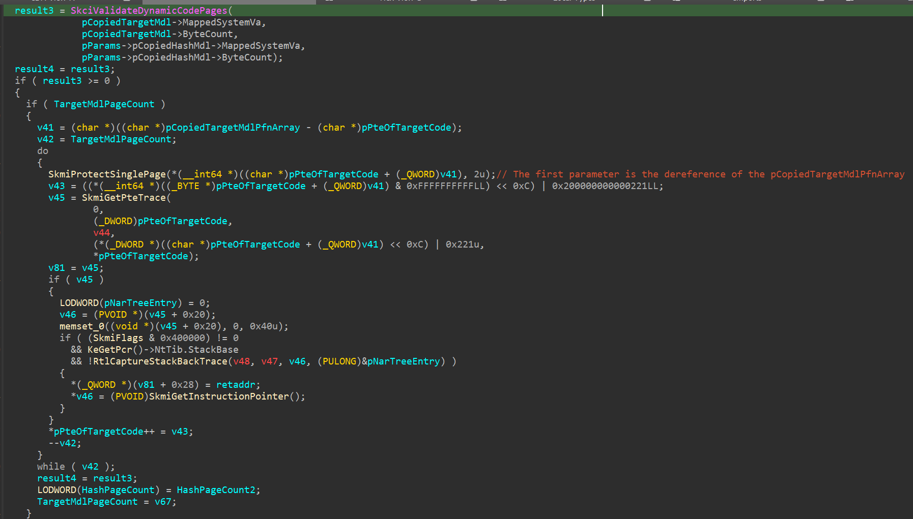

# Introduction

Microsoft Warbird, or just Warbird, is an obfuscation framework or some kind of packer developed by Microsoft to protect important Windows internals like licensing, DRM, and core security features like Code Integrity (CI). This code protection system is built into Windows to make reversing key components like ci.dll, clipsp.sys, and peauth.sys much harder. It dynamically encrypts and decrypts kernel-mode code at runtime, making static analysis on some part of the software impossible. What’s even more interesting is that **Warbird works even on systems with Hypervisor-Enforced Code Integrity (HVCI) and Virtualization-Based Security (VBS), where dynamic code (kernel memory that can change between writable to executable and vice versa) execution in the kernel is supposed to be impossible**. This research examines how Warbird encrypts and decrypts kernel code and how it "bypasses" HVCI and VBS. At the end of this research, I hope atleast one of these 2 things :

1. Find out how MS break their own rules by allowing dynamic codes (warbird) in a HVCI protected kernel
2. Find out how to execute my own dynamic code on VTL0 kernel with HVCI enabled

In this research, all of the binaries that will be analyzed are from Windows 11 version 24H2 (build 26100.6584).

## clipsp.sys

Our analysis starts at `clipsp.sys`, a kernel driver that is part of the Windows client licensing service. This driver is protected by Warbird. First, before we begin to reverse engineer the inner working of Warbird inside `clipsp.sys`, lets take a look at the "outer" of the PE itself using [PE-bear](https://github.com/hasherezade/pe-bear). If we check on the sections of the PE binary, we can already see some clues/signatures about the presence of Warbird. There are some peculiar sections that are not common on normal PEs, and look at the name of them, `PAGEwx`? `wx` means writable executable? Very interesting indeed.


Next, lets start to reverse engineer the Warbird routines inside `clipsp.sys`. Because we dont have any symbol on this driver, lets start our analysis on the exported routine `ClipSpInitialize`.


Here, we can see that it firsts check if the `WarbirdMutex` is initialized, if its not then it initialize it using `KeInitializeEvent`. After that, it tries to decrypt PAGEwx1 and PAGEwx3 warbird-packed section, before it executes a code that resides in the PAGEwx1 section. And after it executed the function inside PAGEwx1, it re-encrypts the PAGEwx1 and PAGEwx3 section. We will focus with the `WarbirdDecryptSection` and `WarbirdReencryptSection` function.


As you might notice, these function actually is just a wrapper function for the same function, `WarbirdEncryptDecryptSection`. These 2 function locks the `WarbirdMutex` mutex, and check for the decryption count stored at `DecryptionData2` structure, if the decryption count is is one then the `WarbirdEncryptDecryptSection` re-encrypt it, and if the decryption count is 0 then the `WarbirdEncryptDecryptSection` decrypts it. This is a way for making the warbird encryption and decryption works in a multithreaded case (where multiple threads are using the instructions inside the warbird-packed sections and are trying to decrypt/reencrypt the section at the same time). Next, lets take a look at how `WarbirdEncryptDecryptSection` works.


```c
struct _PAGEWX_PREPARATION_INFO
{
  DWORD64 NewMdlVa;
  DWORD64 NewMdlLength;
  DWORD64 MdlVaToMappingOffset;
  DWORD IsEncrypt;
  DWORD Unknown5;
  DWORD64 PAGEwxN;
  DWORD64 NewMdl;
  DWORD64 Mdl;
  DWORD IsNewMdlLocked;
  DWORD Unknown9;
  DWORD64 MdlVaOrSectionVa;
  DWORD64 LockedMappedMdlVa;
  DWORD64 MdlLength;
  DWORD64 PAGEwxIndex;
};
```

It first initializes a structure that I call `PAGEWX_PREPARATION_INFO` which contains information like the PAGEwx number and index, MDLs created while encrypting/decrypting the section, current operation (is it encrypt/decrypt), important pointers, and etc. After that, `WarbirdEncryptDecryptSection` will call `WarbirdPrepareSectionForModification`, this function will create the main MDL for the encrypted PAGEwx section, and then use `MmChangeImageProtection` to change the encrypted PAGEwx section to writable (RW). The MmChangeImageProtection is supplied with 4 parameter, first parameter is the PAGEwx main MDL, second parameter is a hash (or atleast partial, more on this later), third parameter is the total size of the hash supplied, and the fourth is the protection flag. MmChangeImageProtection is an undocumented function that, I think, only `clipsp.sys` imports, so we can deduce that MS created this function JUST for kernel-mode warbird. We will talk about `MmChangeImageProtection` further later in this analysis.


After successfully prepared the PAGEwx section for modification, the `WarbirdEncryptDecryptSection` continue with a encryption/decryption loop with a Feistel cipher that they implement. Each loop started with the creation of a writable MDL mapping with a specific starting VA from the Decryption Data 1 of the PAGEwx section, and after that the execution is passed to either `WarbirdFeistelEncrypt` or `WarbirdFeistelDecrypt`. I wont be talking about the specifics in their Feistel cipher encryption or decryption implementation.


And at last, we have arrived to the end of the Warbird encryption/decryption routine. It first cleans any remaining writable MDL mapping thats used for the Feistel encryption/decryption operation, and then it calls `WarbirdFinishSectionModification`. This is the function that will do the job of changing the section from writable to executable in a decryption routine.


So, here we can see what `WarbirdFinishSectionModification` does. If its an encryption routine, it will try to lock the section and unlock it immediately, to be honest I have no idea why they does this and it is even more bizzare when they lock it once and they unlock it twice. Anyway, lets focus our attention on when its a decryption routine. Here, we can see that it calls `MmChangeImageProtection` again, but the difference between this call and the previous call on `WarbirdPrepareSectionForModification` is the fourth parameter is set to 1 instead of 2, I think this indicates that it want to change the protection to executable. And after the `MmChangeImageProtection` call, it cleans up the PAGEwx main MDL and cleans up the `PAGEWX_PREPARATION_INFO` data.


On the next part of the analysis, we will deep dive into `MmChangeImageProtection`, how it works, and how it interoperates with the VTL1.

## ntoskrnl.exe - MmChangeImageProtection

As I mentioned before, `MmChangeImageProtection` is an undocumented function thats used only by Warbird internal routine. It is the most crucial function in the Warbird routine, whose job is to modify memory protections, essentially allowing dynamic code in the kernel. Without `MmChangeImageProtection`, the whole idea of kernel-mode warbird-packed binaries wouldn't be possible. As we know from before, MmChangeImageProtection is used twice, in the `WarbirdPrepareSectionForModification`, where it changes the memory protection to writable, allowing the PAGEwx section to be modified, and in `WarbirdFinishSectionModification`, where it is used to change the memory protection to executable, allowing the decrypted instructions in PAGEwx section to be called and executed.

`MmChangeImageProtection` takes 4 parameters, the first parameter is the target MDL which is the PAGEwx main MDL, the second parameter is the pointer to the decrypted PAGEwx partial SHA512 hash/signature (again, more on this later), the third parameter is the total length of the hash that will be supplied to `MmChangeImageProtection`, and the fourth parameter is the protection flag, which will determine whether the protection that it will change to, either writable to executable.


At the beginning, `MmChangeImageProtection` checks for the parameters, make sure that the MDL it receives is valid, and it also checks if the hash supplied sits inside the module of the memory that the MmChangeImageProtection is trying to change the protection. This means the hash that supplied to it must be from the target module (in this case `clipsp.sys`) itself. Next, this function will check if this module is paged in and in-memory, and it will do some more checks on the underlying PFNs from the PAGEwx main MDL. After all of those, here comes the important part, first it change the memory protection of the target memory to writable, checks if the protection flag parameter is set to executable, and if it is then it checks if either HVCI (indicated by the `StrongCodeGuarantees` bit in `MiFlag`) is turned off or the `VslValidateDynamicCodePages` returns `NT_SUCCESS` status. Now there will be 2 things that will happen that depends on the return code of `VslValidateDynamicCodePages`, if it just returns `NT_SUCCESS` codes **and not 0x12c**, that means the **validity check on the dynamic code failed** and the memory protection will be changed **ONLY ON THE VTL0 LEVEL!** Meaning is that the VTL0 PTE is marked as executable, but when you execute it, you will still get access violation, because the VTL1 EPTE is still set to writable. But if `VslValidateDynamicCodePages` **returns 0x12c**, that means the **validity check succeeds**, the dynamic code is deemed valid, and **both the VTL0 PTE and the VTL1 EPTE is set to executable**.


Now you might be asking, `what does this have to do with them "partial" hashes you mentioned before?`, well it got to do with everything. `VslValidateDynamicCodePages` is the function that `MmChangeImageProtection` use to essentially communicate and interoperates with the VTL1 kernel A.K.A. the Secure Kernel. And through this, the "partial" hashes are used to validate the dynamic code and determines if the VTL1 EPTE is going to be set to executable or not. On the next part of the analysis, we will deep dive into `VslValidateDynamicCodePages`, what data or parameters it takes, and how it transfers them to VTL1.

## ntoskrnl.exe - VslValidateDynamicCodePages

`VslValidateDynamicCodePages` is another undocumented function thats used by `MmChangeImageProtection` to validates the dynamic code and interoperates with the VTL1 kernel. This function jobs is to prepare our data for transfer to VTL1 kernel and to emit the `vmcall` (A.K.A. hypercall) instruction using the corresponding secure system call number, in this case `0x20`, to actually call the actual secure kernel function, which is `SkmiValidateDynamicCodePages`. This function takes 3 parameter. The first parameter is the target MDL, which in this context is our PAGEwx main MDL. The second parameter is a pointer to our partial hashes, and the third parameter is the total hash size supplied. The first thing this function does is to create another MDL for our target MDL, from what I observed, any data transfer to VTL1 always requires this "second level" MDL, where it creates another MDL that maps the first MDL, pretty cool huh. After it creates another MDL that maps our target MDL, it also creates an MDL and another MDL for the first MDL for our hash buffer using the `VslpLockPagesForTransfer` function. After that, it will send a pointer to the original (or the first level) target MDL, the PFN of the original target MDL thats created from the second level target MDL, a pointer to the first level hash MDL, the PFN of the first level MDL thats created from the second level hash MDL, and the SSCN (secure service call number) that we want to call, then it get packaged all up into a single data structure called `SKCALL`. And after that, it will call `VslpEnterIumSecureMode`, which is the function that will emit the `vmcall` instruction and call our target function that the SSCN points to.


In the next part of our analysis, we will deep dive into `SkmiValidateDynamicCodePages`, which is the secure kernel function in VTL1 that our previous SSCN will point to. 

## securekernel.exe - SkmiValidateDynamicCodePages

Before we arrive at `SkmiValidateDynamicCodePages`, all secure kernel calls will arrive at `IumInvokeSecureService`. In this function, there will be a huge switch case that will handle each SSCN. If we take a look at the `0x20` switch case, we will see this piece of code below. Here, we can see that it collects the parameters from the `SKCALL` structure, and then it creates its own MDL mapping of the hash data based on the given hash MDL and the PFN. After that, it copies all of the previous parameters, package it into its own structure, and pass it to `SkmiValidateDynamicCodePages` through `SkmiOperateOnLockedNar`. I wont going deep into how `SkmiOperateOnLockedNar` works because of how lacking the current information we have about NAR structure.


From the `SkmiOperateOnLockedNar`, the execution is then passed to `SkmiValidateDynamicCodePages` by passing 2 things, a pointer to a NAR tree entry and a structure containing previous parameters like the copied hash MDL thats used to create its own MDL mapping of the hash data, the starting VA of the hash data, the target MDL, and the target MDL PFN. In the `SkmiValidateDynamicCodePages`, it starts with creating its own MDL mapping of the target memory based on the given target MDL and its PFN, because if you remember from before, only the hash data is mapped until now. After that, it performs some checks on the PTEs of the hash data, like making sure that the PTE is created from MDL mappings, ensuring PDE/PTE hierarchy (must not be LARGE PDE (2MB)), and then it locks the page that corresponds to that PTE and increments the page reference count. 


Next, it will call the function that will validate our dynamic code hash, which is `SkciValidateDynamicCodePages`, which will be discussed deeper in the next part of the analysis, and if it returns `NT_SUCCCESS` codes, it will call `SkmiProtectSinglePage` which will then **modify the VTL1 EPTE of the target memory so that it will make it executable**. This is the important part, `SkciValidateDynamicCodePages` need to return an `NT_SUCCESS` code so that our target memory, which in this context is those PAGEwx sections, will be marked as executable in the EPTE. Inside `SkmiProtectSinglePage`, it uses either a function called `ShvlpInitiateVariableHypercall` or `ShvlpInitiateFastHypercall`, both of which will emit a `vmcall` that will modify the VTL protection mask. You can check [here](https://learn.microsoft.com/en-us/virtualization/hyper-v-on-windows/tlfs/hypercalls/overview) to see the operations that `vmcall` can do.



After that, the function will do some clean ups like decrement the page reference count, release physical pages, release other locks, and unmap the mapped target memory that came from VTL0. And when the function returns to `IumInvokeSecureService`, it will then unmap the mapped hash data that came from VTL0 too. On the next part of our analysis, we will discuss deeper about `SkciValidateDynamicCodePages`, what parameters it takes, how it generates the hash, and explains the "partial" hash from `clipsp.sys`.

## skci.dll - SkciValidateDynamicCodePages
